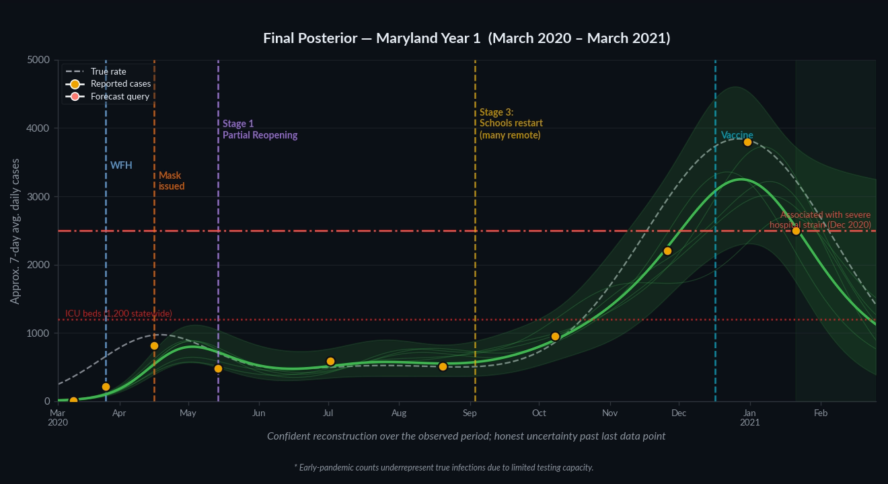

# MOVID Forecasting Example

Renders an animated MP4 walking through every step of **Gaussian Process regression**
using a stylised COVID-19 outbreak modelled on **Maryland's first year (Mar 2020 – Mar 2021)**.

## Learning objectives

After watching this animation and reading this document, you should be able to:

- Explain what a **prior distribution** is and why it represents uncertainty before seeing data
- Describe how **Bayes' theorem** updates the prior into a posterior when observations arrive
- Interpret a **confidence band**: why it narrows near observations and widens in gaps
- Distinguish **interpolation** (querying between data points) from **extrapolation** (querying beyond them) and explain why they produce different levels of uncertainty
- Read the predictive mean and covariance equations and identify what each matrix term computes
- List two ways that changing `RBF_LENGTH_SCALE` or `NOISE` would change the posterior

**Recommended prerequisites:** basic probability (mean, variance, conditional probability),
introductory linear algebra (matrix multiplication, inverse), and enough Python to run the script.



---

## What is Gaussian Process Regression?

### Intuition first

Before the equations, here are three analogies that capture what a GP actually does:

**The kernel as a similarity score.**
The kernel function `k(x, x')` answers the question: *"If I know the case count at week `x`,
how much should that tell me about week `x'`?"* Nearby weeks get a high score (strongly
correlated); distant weeks get a low score (weakly correlated). The length-scale `ℓ` controls
how quickly the score falls off with distance.

**The posterior update as weighted averaging.**
When a new observation arrives, the GP pulls the mean curve toward that point — and the amount
of pull depends on how close each other location is to it (via the kernel). Nearby locations
get pulled a lot; distant locations barely move.

**The CI band as honest ignorance.**
The shaded band is not an error bar on the data — it is the model's statement about which
curves are still plausible given everything it has seen. A wide band means many curves fit;
a narrow band means only a few do. Widening away from the data is correct behaviour, not a flaw.

---

### Formal definition

A **Gaussian Process (GP)** is a probability distribution over functions.
Instead of fitting a single curve to data, a GP keeps track of *every* plausible curve
simultaneously and reports how confident it is at each point.

Formally, a GP is specified by:

- **Mean function** `m(x)` — the expected value of the function at input `x` (often set to 0 or a constant baseline).
- **Covariance (kernel) function** `k(x, x')` — encodes how correlated the function values at `x` and `x'` are.

This animation uses the **RBF (Radial Basis Function) kernel**, also called the squared-exponential kernel:

```
k(x, x') = σ² · exp( −(x − x')² / (2ℓ²) )
```

where `σ` controls the overall amplitude and `ℓ` is the **length-scale**.

---

### Connections to models you may already know

| Model | Relationship to GP |
|-------|--------------------|
| Linear regression | A GP with a linear kernel `k(x,x') = x·x'`; GP generalises it to any shape |
| Ridge regression | Equivalent to a GP with a particular kernel and Gaussian prior on weights |
| Kernel smoothing / LOESS | GP is the Bayesian version — it gives uncertainty estimates, not just a curve |
| Kriging (geostatistics) | Exactly the same method, developed independently for spatial interpolation |

---

### The Bayesian view

GP regression is a direct application of **Bayesian inference**:

| Concept | Bayesian term | What you see in the animation |
|---------|--------------|-------------------------------|
| Belief before seeing data | **Prior** | Wide shaded band — all smooth epidemic curves are plausible |
| Data (observed case counts) | **Likelihood** | Orange dots added one scene at a time |
| Updated belief after data | **Posterior** | Narrowed band that passes through the observations |

The update rule is Bayes' theorem:

```
P(function | data)  ∝  P(data | function) · P(function)
         ↑                     ↑                   ↑
      posterior             likelihood            prior
```

Because both the prior and the likelihood are Gaussian, the posterior is also Gaussian —
and it has a **closed-form analytical solution**. This is what makes GP regression tractable
without Monte Carlo sampling.

---

### Prior → Posterior in closed form

Given `n` training points `X` with noisy observations `y = f(X) + ε`, `ε ~ N(0, σ_n² I)`,
the posterior predictive distribution at new inputs `X*` is:

```
μ*(X*)  = K(X*, X) · [K(X, X) + σ_n² I]⁻¹ · y
Σ*(X*)  = K(X*, X*) − K(X*, X) · [K(X, X) + σ_n² I]⁻¹ · K(X, X*)
```

where `K(A, B)` denotes the matrix of kernel evaluations between rows of `A` and `B`.

**Annotated breakdown of the mean equation:**

```
μ*(X*) = K(X*, X)  ·  [K(X, X) + σ_n² I]⁻¹  ·  y
            ↑                   ↑                  ↑
    "how similar is      "invert the training    "the actual
     each test point      kernel, regularised     observations"
     to each training     by noise σ_n²"
     point?"
```

Reading left to right: first invert the (noise-regularised) training kernel to find the
*residuals* — how much each observation differs from what the kernel alone would predict.
Then weight those residuals by how similar each test point is to each training point.
The result is a distance-weighted sum of the observations, where "distance" is measured by
the kernel, not Euclidean distance.

**For the covariance:**
- The `K(X*, X*)` term is the *prior* variance at the test points.
- The subtracted term is how much variance the observations *explain away*.
- Near observations: the subtracted term ≈ K(X*,X*) → variance collapses toward zero.
- Far from observations: the subtracted term ≈ 0 → variance reverts to the prior.

---

### Common misconceptions

> **"The CI band is a prediction interval for new data points."**
> Not quite. The band shows uncertainty about the *underlying function* (the true epidemic
> curve). A prediction interval for a new noisy observation would be wider — it adds the
> measurement noise `σ_n²` on top of the function uncertainty.

> **"The mean line is a least-squares fit."**
> No. It is the *expected value of the posterior distribution over functions* — the average
> of all plausible curves, weighted by how well they fit the data. It happens to look like a
> smooth fit, but the derivation is entirely probabilistic.

> **"A wider CI means the model is wrong."**
> A wider CI means the model is *honest*. It widens wherever the data do not constrain the
> function — which is the correct, calibrated response to a lack of information.

> **"More data always makes the posterior better."**
> More data always makes it *narrower*, but narrower is not the same as correct. If the
> kernel or noise assumptions are wrong, the posterior can be confidently wrong.

---

## scikit-learn implementation

This project uses **scikit-learn's `GaussianProcessRegressor`** (`sklearn.gaussian_process`).
To enforce non-negativity (case counts cannot go below zero), the GP is fit in **log-space**:
observations are transformed to `log(y)` before fitting, and predictions are exponentiated back.
This gives asymmetric confidence intervals — wider on the upside, narrower on the downside —
which is appropriate for epidemic counts that grow and decay multiplicatively.

```python
from sklearn.gaussian_process import GaussianProcessRegressor
from sklearn.gaussian_process.kernels import RBF, ConstantKernel

kernel = (ConstantKernel(constant_value=RBF_LOG_STD**2,
                         constant_value_bounds='fixed') *
          RBF(length_scale=RBF_LENGTH_SCALE,
              length_scale_bounds='fixed'))

log_noise = np.log1p(NOISE / PRIOR_MEAN)   # noise std in log-space (delta method)
gpr = GaussianProcessRegressor(
    kernel=kernel,
    alpha=log_noise**2,   # observation noise variance in log-space
    optimizer=None,       # fix hyperparameters — no MLE optimisation
    normalize_y=False,
)
# Fit in log-space, predict in log-space, exponentiate back:
gpr.fit(X_train, np.log(y_train) - np.log(PRIOR_MEAN))
log_mu, log_sig = gpr.predict(X_test, return_std=True)
mu = np.exp(log_mu + np.log(PRIOR_MEAN))          # median prediction
lo = np.exp(log_mu + np.log(PRIOR_MEAN) - 1.96 * log_sig)   # lower CI bound (always ≥ 0)
hi = np.exp(log_mu + np.log(PRIOR_MEAN) + 1.96 * log_sig)   # upper CI bound
```

Key design choices:

| Choice | Reason |
|--------|--------|
| Log-space fitting | Case counts are non-negative and grow multiplicatively; log-transform enforces positivity and makes the noise more homogeneous |
| `optimizer=None` | Hyperparameters are set manually from domain knowledge; no log-marginal-likelihood optimisation is needed for the animation |
| `alpha=log_noise**2` | Adds `σ_n² I` to the training kernel matrix — handles measurement noise and prevents numerical blow-up |
| `return_cov=True` for sampling | Returns the full posterior covariance matrix so we can draw self-consistent sample paths via `multivariate_normal` |
| Eigenvalue clamping | `np.linalg.eigh` + `np.maximum(eigenvalues, 0)` corrects any tiny negative eigenvalues from floating-point round-off before drawing samples |

---

## Parameter sensitivity — try it yourself

All tunable values live in the `CONFIGURATION` block at the top of `movid_forecasting_example.py`.
Re-run `pixi run render` after any change to see the effect.

| Variable | Default | What happens if you increase it | What happens if you decrease it |
|----------|---------|----------------------------------|----------------------------------|
| `NOISE` | 150 | Data trusted less → wider posterior, mean pulled less toward dots | Data trusted more → mean passes closer to dots, narrower CI |
| `RBF_LENGTH_SCALE` | 6.0 weeks | Smoother curves, correlations span more weeks | Wiggly curves, each observation influences a narrower window |
| `RBF_LOG_STD` | 0.8 | Wider prior band, model allows larger swings | Tighter prior band, model is sceptical of extreme values |
| `PRIOR_MEAN` | 600 | Prior centred higher; affects regions with no data | Prior centered lower |
| `CI_MULTIPLIER` | 1.96 | Wider band (e.g. 2.58 → 99 % CI) | Narrower band (e.g. 1.0 → ~68 % CI) |
| `N_SAMPLES` | 5 | More sample paths shown | Fewer sample paths |
| `TRANSITION` | 25 | Slower morph between scenes | Faster morph |

---

## Exercises and discussion questions

These can be answered by modifying the script and re-running, or by reasoning from the equations.

1. **Interpolation vs. extrapolation.** Scene 7 queries week 15 (between observations) and scene 8
   queries week 52 (beyond all observations). Why is the CI narrow in scene 7 and wide in scene 8?
   What would happen if you moved the scene-8 query to week 48?

2. **Effect of a new observation.** Add a row `[50, 1800]` to the `OBS` array. How does the
   posterior at week 52 change? Does the model become more or less certain about the extrapolation?

3. **Length-scale intuition.** Set `RBF_LENGTH_SCALE = 1.0` and re-render. The posterior will
   become very wiggly. Now try `RBF_LENGTH_SCALE = 20.0`. Why does a longer length-scale make the
   model more resistant to sharp changes in the data?

4. **Noise vs. fit.** Set `NOISE = 10` (very low noise — the model almost interpolates exactly).
   Then set `NOISE = 800` (very high noise — the model barely moves toward observations). Which
   setting is more appropriate for reported COVID case counts, and why?

5. **Prior sensitivity.** In scene 1, no data has been observed. Change `PRIOR_MEAN` from 1000 to
   3000. Does the final posterior (scene 9) change? Why or why not?

6. **The role of the kernel.** The confidence band is wider between W11 and W18 than between W39
   and W44, even though both gaps contain no observations. Looking at the observations on either
   side of each gap, explain why the GP is more confident in one gap than the other.

7. **Misconception check.** A classmate says: *"The GP mean line passes through all the data
   points, so it's just interpolation."* Where are they right, and where are they wrong?

---

## Historical basis

Case counts and event dates are derived from Maryland's actual COVID-19 record.
Week 1 = March 5, 2020 (first confirmed Maryland case); Week 52 = March 4, 2021.
All case figures are **approximate 7-day average daily cases**; early values underrepresent
true infections due to limited testing capacity.

| Week | Approx. date | Event / observation |
|------|-------------|---------------------|
| W2  | Mar 12 | First confirmed cases (~5–15/day reported)*; highly uncertain due to testing limits |
| W4  | Mar 26 | First wave climbing (~220/day)*; **Stay-at-home order** (Mar 23) |
| W7  | Apr 16 | First wave peak (~820/day); **Mask mandate issued** (Apr 15) |
| W11 | May 14 | Post-peak decline (~480/day); **Stage 1 partial reopen** (May 15) |
| W18 | Jul 2  | Summer plateau (~590/day) |
| W25 | Aug 20 | Late summer (~510/day) |
| W27 | Sep 4  | **Stage 3 reopening** — schools authorized to resume; many districts stayed remote or hybrid |
| W32 | Oct 8  | Fall surge building (~900–1,100/day) |
| W39 | Nov 26 | Thanksgiving surge (~2,200/day) |
| W42 | Dec 17 | **Vaccine rollout begins** (first doses Dec 14) |
| W44 | Dec 31 | Winter peak (~3,800/day) |
| W47 | Jan 28 | Post-peak declining (~2,500/day) |

\* Early counts are especially imprecise due to limited testing in Mar–Apr 2020.

Hospital reference lines:
- **ICU beds (1,200):** total licensed ICU beds statewide (MHCC FY2020); surge capacity and staffing varied
- **~2,500 cases/day:** level associated with severe hospital strain in Dec 2020 — not an official threshold

---

## Scenes

| # | Scene | What you see | Key statistical concept |
|---|-------|-------------|------------------------|
| 1 | Prior | Wide uncertainty band — any smooth curve is plausible | The prior encodes beliefs before data; all functions consistent with the kernel are possible |
| 2 | First cases + WFH | Seeding at W2; stay-at-home order appears at W4 | Two observations constrain the left tail; the band narrows only near those points |
| 3 | First wave peak + mask mandate | Sharp rise to W7; Stage 1 reopen at W11 | Posterior contracts around a cluster of observations; uncertainty grows in the unobserved middle |
| 4 | Summer plateau | Cases settle ~500–600/day; Stage 3 annotation | Dense mid-year observations → narrow CI in that region; far ends still uncertain |
| 5 | Fall / Thanksgiving surge | Rapid acceleration toward winter peak | New high-value observations pull the mean up; extrapolation beyond W39 remains wide |
| 6 | Winter peak + vaccine rollout | ~3,800/day peak; vaccine line at W42 | All 10 observations revealed; posterior is well-constrained across the full year |
| 7 | Interpolation (W15) | Query between waves → narrow CI | Interpolation: neighbouring observations bound the function tightly on both sides |
| 8 | Extrapolation (W52) | Query past last data → wide, honest uncertainty | Extrapolation: no observations to the right → variance reverts toward the prior |
| 9 | Final posterior | Full year reconstruction; forecast region shaded | The complete posterior: a distribution over plausible epidemic trajectories for the year |

The dashed white line shows the **simulated ground truth** — a smooth three-Gaussian
approximation of Maryland's spring, summer, and winter epidemic waves, chosen to match
observed wave timing and magnitudes. This is a visualization aid, not a mechanistic model;
real epidemic curves are not Gaussian in shape.

---

## Quick start

### Prerequisites
Install [pixi](https://prefix.dev/docs/pixi/overview):
```
curl -fsSL https://pixi.sh/install.sh | bash
```

### Run
```bash
pixi run render
```

This installs all dependencies into an isolated environment and writes
`outbreak_animation.mp4` into the current directory at 30 fps.

### Or run directly (if you have Python + ffmpeg already)
```bash
pip install numpy matplotlib scikit-learn tqdm
python movid_forecasting_example.py
```

---

## Project structure

```
outbreak_gaussian_process/
├── pixi.toml                     # environment + task definitions
├── movid_forecasting_example.py  # animation script
├── preview.png                   # final-frame preview (for this README)
└── README.md
```

---

## Further reading

| Resource | Why it's useful |
|----------|----------------|
| Rasmussen & Williams, [*Gaussian Processes for Machine Learning*](http://www.gaussianprocess.org/gpml/) (free PDF) | The canonical reference; Chapters 1–2 cover everything in this animation rigorously |
| Görtler et al., [*A Visual Exploration of Gaussian Processes*](https://distill.pub/2019/visual-exploration-gaussian-processes/) (distill.pub, 2019) | Interactive browser-based visualisation — ideal companion to this animation |
| Bishop, *Pattern Recognition and Machine Learning*, Chapter 6 | Situates GP within the broader Bayesian / kernel framework; connects to SVMs and relevance vector machines |
| scikit-learn docs, [Gaussian Processes](https://scikit-learn.org/stable/modules/gaussian_process.html) | Implementation reference with worked examples and hyperparameter tuning guidance |

---

## Data sources

Historical case counts and event dates are approximations derived from the following public sources:

- **Maryland Department of Health — COVID-19 Data Dashboard**
  https://health.maryland.gov/covid/Pages/Maryland-COVID-19-Data.aspx

- **COVID-19 pandemic in Maryland — Wikipedia**
  https://en.wikipedia.org/wiki/COVID-19_pandemic_in_Maryland

- **MarylandReporter — largest one-day case spike (Apr 9, 2020)**
  https://marylandreporter.com/2020/04/09/maryland-has-its-largest-one-day-rise-in-covid-19-cases/

- **USAFacts — Maryland COVID-19 overview (Omicron peak ~13,400/day Jan 2022)**
  https://usafacts.org/answers/how-did-covid-19-affect-people-in-the-us/state/maryland/

- **Maryland Health Care Commission — Licensed Acute Care Beds FY2020 (ICU bed count)**
  https://mhcc.maryland.gov/mhcc/pages/hcfs/hcfs_hospital/documents/acute_care/chcf_Licensed_Acute_Care_Beds_by_Hospital_and_Service_%20Maryland_FY2020.pdf

- **Baltimore Sun — Maryland ICU bed capacity at pandemic onset (Mar 2020)**
  https://www.baltimoresun.com/coronavirus/bs-hs-coronavirus-icu-beds-20200313-sg7g7zvkkzhy5ncog5dit53tgm-story.html

- **Washington Post — Maryland hospitals near capacity (Dec 2021)**
  https://www.washingtonpost.com/dc-md-va/2021/12/15/maryland-hospitals-coronavirus-capacity/
